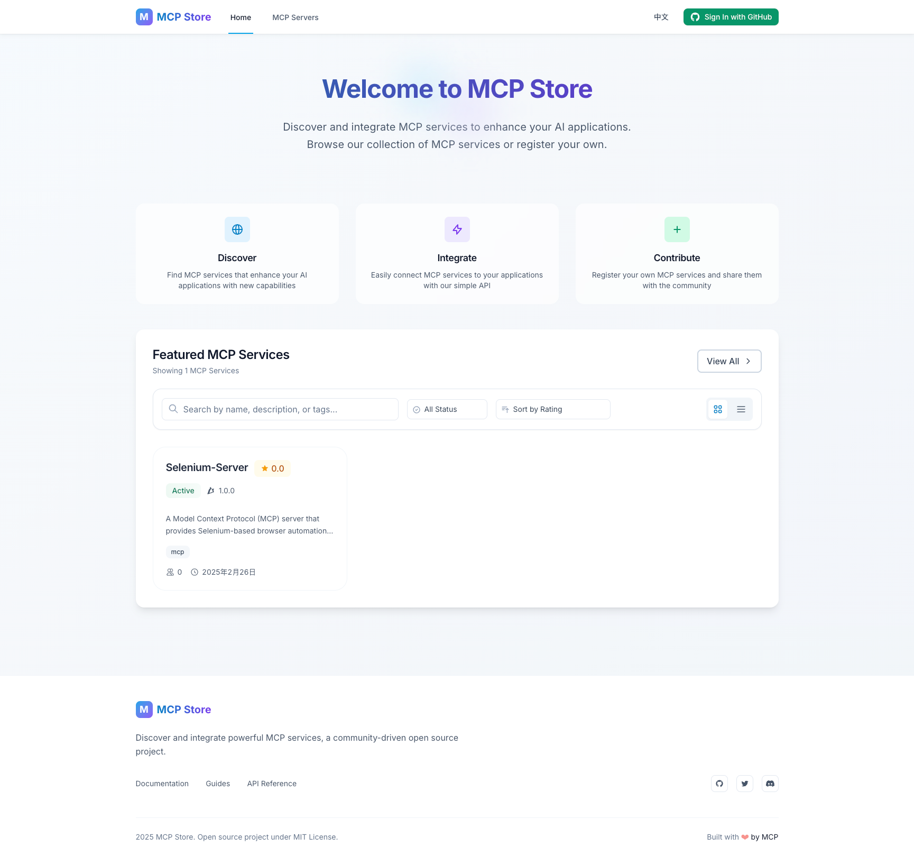

# MCP Store

MCP Store 是一个基于 React + TypeScript 的应用程序，用于管理模型上下文协议（Model Context Protocol，MCP）服务器。该平台允许用户注册、发现和管理 MCP 服务器，并提供身份验证、评论和收藏等功能。



## 功能特性

- 🔐 多种登录方式（Google、GitHub、邮箱）
- 🌐 国际化支持（中文、英文）
- 💾 Supabase 后端集成
- 🎨 TailwindCSS 样式设计
- 📱 响应式设计
- ⭐ 服务器评分与评论
- 🔖 收藏喜欢的服务器

## 环境要求

开始之前，请确保已安装：

- Node.js（v16 或更高版本）
- npm 或 yarn
- Git

## 安装与配置

1. 克隆仓库：
```bash
git clone <repository-url>
cd mcp-store
```

2. 安装依赖：
```bash
npm install
```

3. 配置环境变量：
```bash
cp .env.example .env
```

4. 设置 Supabase：

   a. 在 [Supabase](https://supabase.com) 创建新项目
   
   b. 进入项目设置 > API 获取项目 URL 和匿名密钥
   
   c. 更新 `.env` 文件中的 Supabase 凭证：
   ```
   VITE_SUPABASE_URL=你的_supabase_项目_url
   VITE_SUPABASE_ANON_KEY=你的_supabase_匿名密钥
   ```
   
   d. 运行数据库迁移：
   - 进入 Supabase 控制台 > SQL 编辑器
   - 复制 `supabase/migrations/initial_schema.sql` 的内容
   - 执行 SQL 以设置数据库架构

5. 配置 OAuth 提供商（可选）：

   **GitHub OAuth：**
   1. 进入 GitHub 开发者设置
   2. 创建新的 OAuth 应用
   3. 设置首页 URL 为 `http://localhost:3000`
   4. 设置授权回调 URL 为 `http://localhost:3000/auth/callback`
   5. 将凭证添加到 `.env`：
   ```
   VITE_GITHUB_CLIENT_ID=你的_github_客户端_id
   VITE_GITHUB_CLIENT_SECRET=你的_github_客户端密钥
   ```
   6. 生产环境：在 Supabase 控制台 > Auth > Providers > GitHub 中配置客户端密钥

   **Google OAuth：**
   1. 进入 Google Cloud Console
   2. 创建项目并启用 OAuth
   3. 配置 OAuth 许可屏幕
   4. 创建 OAuth 客户端 ID 凭证
   5. 添加到 `.env`：
   ```
   VITE_GOOGLE_CLIENT_ID=你的_google_客户端_id
   ```

## 开发

启动开发服务器：
```bash
npm run dev
```

其他可用命令：
```bash
npm run build      # 构建生产版本
npm run preview    # 预览生产构建
npm run lint       # 运行 ESLint
npm run test      # 运行测试
npm run coverage   # 生成测试覆盖率报告
```

## 项目结构

```
mcp-store/
├── src/
│   ├── components/        # React 组件
│   │   ├── common/       # 共享组件
│   │   ├── features/     # 功能特定组件
│   │   └── layout/       # 布局组件
│   ├── contexts/         # React 上下文
│   ├── hooks/           # 自定义 React hooks
│   ├── locales/         # i18n 翻译文件
│   ├── pages/           # 页面组件
│   ├── services/        # API 服务
│   ├── styles/          # CSS 样式
│   ├── types/           # TypeScript 类型
│   └── utils/           # 工具函数
├── supabase/
│   └── migrations/      # 数据库迁移文件
└── public/             # 静态资源
```

## 环境变量

在根目录创建 `.env` 文件，包含以下变量：

```env
# Supabase 配置
VITE_SUPABASE_URL=你的_supabase_项目_url
VITE_SUPABASE_ANON_KEY=你的_supabase_匿名密钥

# API 配置
VITE_API_URL=http://localhost:3000
VITE_ENV=development

# 功能开关
VITE_ENABLE_WEB3=false
VITE_ENABLE_ANALYTICS=false
```

## 数据库架构

应用程序使用 Supabase 数据库，包含以下主要表：

- `profiles`：用户档案和认证信息
- `servers`：MCP 服务器详情和元数据
- `reviews`：用户评论和评分
- `bookmarks`：用户收藏的服务器

每个表都配置了适当的行级安全策略（RLS）以保护数据。

## 功能清单

### ✅ 已完成功能
- ✅ 多提供商身份验证（Google、GitHub、邮箱）
- ✅ 国际化支持（中文、英文）
- ✅ Supabase 后端集成
- ✅ 服务器注册和管理
- ✅ 基于 TailwindCSS 的响应式设计

### 🚀 计划功能
- ⭐ 服务器评分和评论系统
- �� 收藏喜欢的服务器
- 🎮 在线 MCP 测试环境 - 交互式 MCP 服务器测试平台
- 🤖 MCP 个性化定制 - 通过与 LLM 的自然语言对话生成并注册 MCP 工具
- 🔄 MCP 智能代理 - 使用 MCP 工具完成智能任务的 AI 代理
  - 加班程序员自动点餐
  - 定期购买生活用品
  - 更多智能任务自动化
- 📝 更多功能开发中...


## 许可证

MCP Store 使用 MIT 许可证。详细信息请查看 [LICENSE](LICENSE) 文件。
