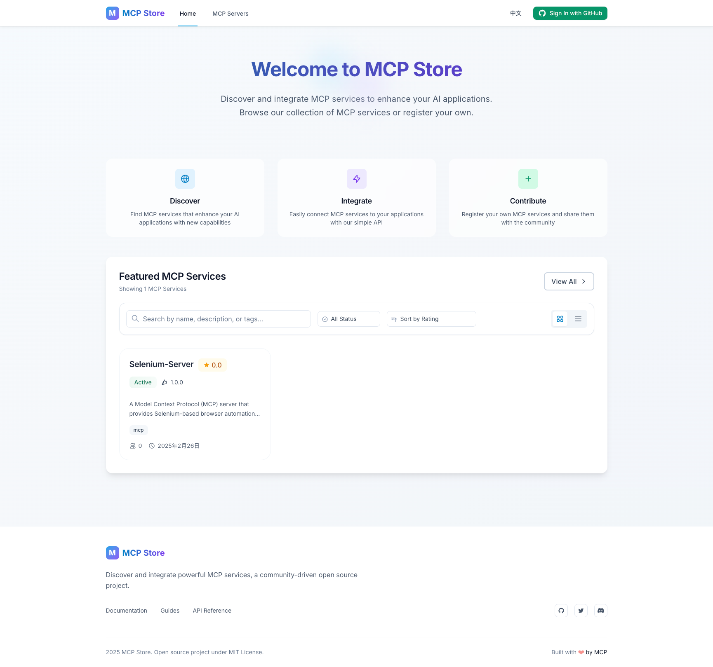

# MCP Store

[中文文档](README-zh.MD)

MCP Store is a React + TypeScript application for managing Model Context Protocol (MCP) servers. It provides a platform for users to register, discover, and manage MCP servers with features like authentication, reviews, and bookmarks.



## Features

- 🔐 Authentication with multiple providers (Google, GitHub, Email)
- 🌐 Internationalization support (English, Chinese)
- 💾 Supabase backend integration
- 🎨 TailwindCSS for styling
- 📱 Responsive design
- ⭐ Server ratings and reviews
- 🔖 Bookmark favorite servers

## Prerequisites

Before you begin, ensure you have installed:

- Node.js (v16 or higher)
- npm or yarn
- Git

## Installation & Setup

1. Clone the repository:
```bash
git clone <repository-url>
cd mcp-store
```

2. Install dependencies:
```bash
npm install
```

3. Configure environment variables:
```bash
cp .env.example .env
```

4. Set up Supabase:

   a. Create a new project at [Supabase](https://supabase.com)
   
   b. Go to Project Settings > API to get your project URL and anon key
   
   c. Update your `.env` file with Supabase credentials:
   ```
   VITE_SUPABASE_URL=your_supabase_project_url
   VITE_SUPABASE_ANON_KEY=your_supabase_anon_key
   ```
   
   d. Run the database migrations:
   - Go to Supabase Dashboard > SQL Editor
   - Copy the contents of `supabase/migrations/initial_schema.sql`
   - Execute the SQL to set up the database schema

5. Configure OAuth providers (optional):

   **GitHub OAuth:**
   1. Go to GitHub Developer Settings
   2. Create a new OAuth App
   3. Set Homepage URL to `http://localhost:3000`
   4. Set Authorization callback URL to `http://localhost:3000/auth/callback`
   5. Add credentials to `.env`:
   ```
   VITE_GITHUB_CLIENT_ID=your_github_client_id
   VITE_GITHUB_CLIENT_SECRET=your_github_client_secret
   ```
   6. For production: Configure Client Secret in Supabase Dashboard > Auth > Providers > GitHub

   **Google OAuth:**
   1. Go to Google Cloud Console
   2. Create a project and enable OAuth
   3. Configure OAuth consent screen
   4. Create OAuth client ID credentials
   5. Add to `.env`:
   ```
   VITE_GOOGLE_CLIENT_ID=your_google_client_id
   ```

## Development

Start the development server:
```bash
npm run dev
```

Other available commands:
```bash
npm run build      # Build for production
npm run preview    # Preview production build
npm run lint       # Run ESLint
npm run test       # Run tests
npm run coverage   # Generate test coverage
```

## Project Structure

```
mcp-store/
├── src/
│   ├── components/        # React components
│   │   ├── common/       # Shared components
│   │   ├── features/     # Feature-specific components
│   │   └── layout/       # Layout components
│   ├── contexts/         # React contexts
│   ├── hooks/           # Custom React hooks
│   ├── locales/         # i18n translations
│   ├── pages/           # Page components
│   ├── services/        # API services
│   ├── styles/          # CSS styles
│   ├── types/           # TypeScript types
│   └── utils/           # Utility functions
├── supabase/
│   └── migrations/      # Database migrations
└── public/             # Static assets
```

## Environment Variables

Create a `.env` file in the root directory with the following variables:

```env
# Supabase Configuration
VITE_SUPABASE_URL=your_supabase_project_url
VITE_SUPABASE_ANON_KEY=your_supabase_anon_key

# API Configuration
VITE_API_URL=http://localhost:3000
VITE_ENV=development

# Feature Flags
VITE_ENABLE_WEB3=false
VITE_ENABLE_ANALYTICS=false
```

## Database Schema

The application uses Supabase with the following main tables:

- `profiles`: User profiles and authentication information
- `servers`: MCP server details and metadata
- `reviews`: User reviews and ratings for servers
- `bookmarks`: User bookmarks for favorite servers

Each table has appropriate Row Level Security (RLS) policies configured for data protection.

## TodoList

### ✅ Completed Features
- ✅ Multi-provider authentication (Google, GitHub, Email)
- ✅ Internationalization support (English, Chinese)
- ✅ Supabase backend integration
- ✅ Server registration and management
- ✅ Responsive design with TailwindCSS

### 🚀 Planned Features
- ⭐ Server ratings and reviews system
- 🔖 Bookmark favorite servers
- 🎮 Online MCP Playground - Interactive testing environment for MCP servers
- 🤖 MCP Customization - Generate and register MCP tools through natural language conversations with LLM
- 🔄 MCP Agent - AI-powered agent for automating tasks using MCP tools
  - Auto food ordering for overtime developers
  - Scheduled shopping for daily necessities
  - And more intelligent task automation
- 📝 More features coming soon...

## License

MCP Store is licensed under the MIT License. See the [LICENSE](LICENSE) file for details.
